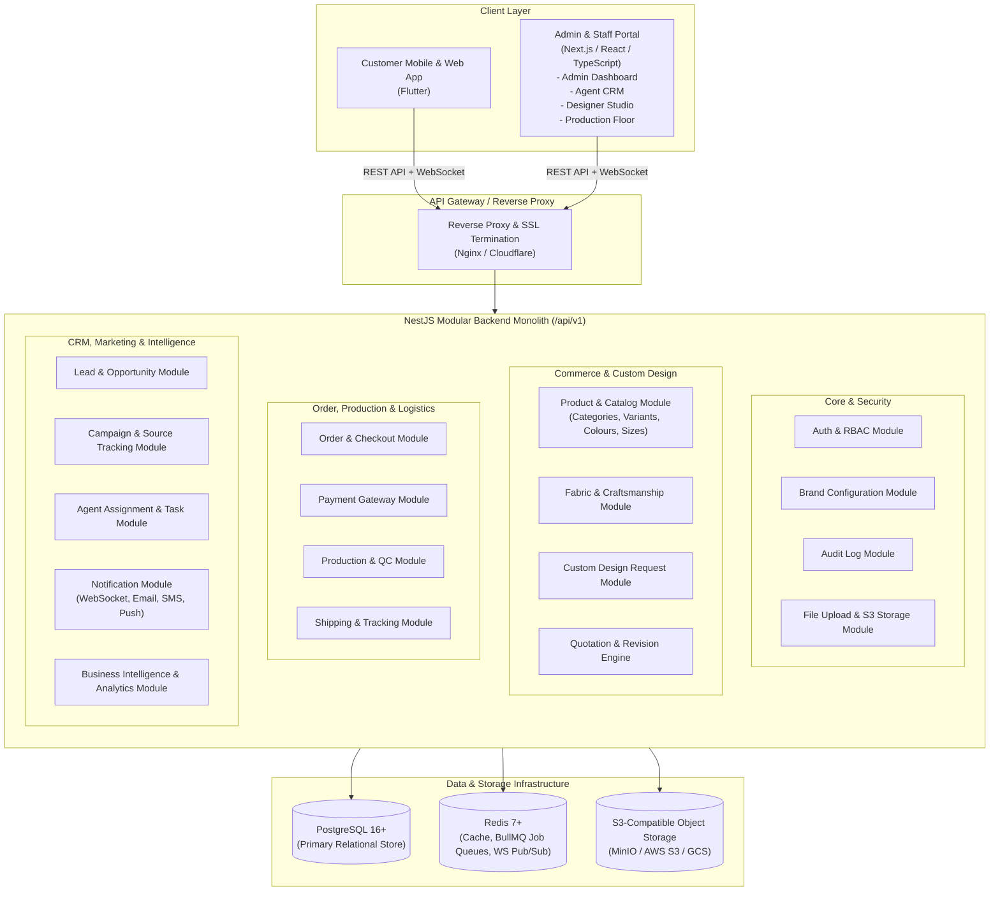
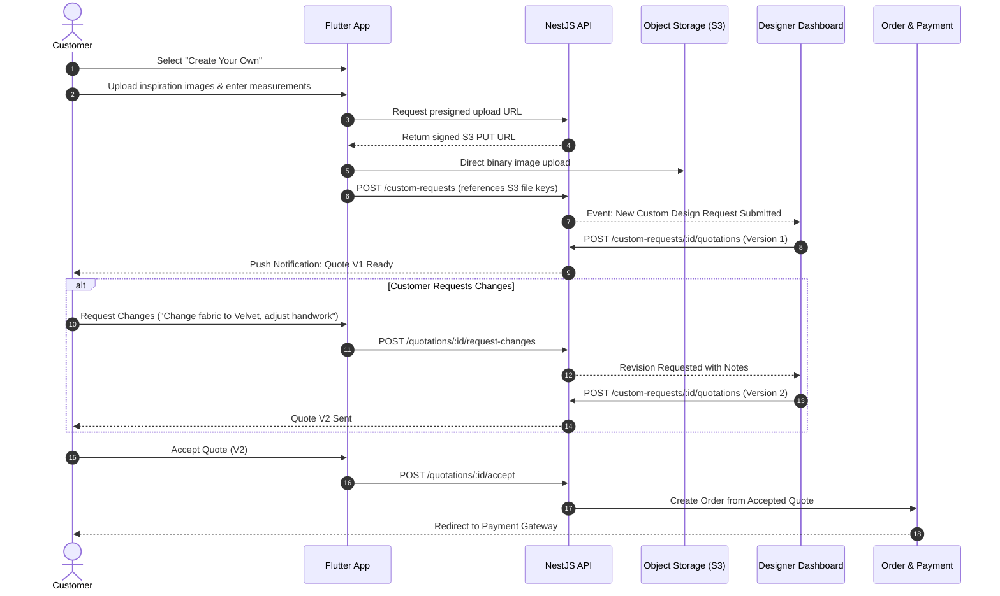

# System Architecture: KHADIJA-TUL-QUBRAH BY Meer&Mus

## 1. Executive Summary & Brand Identity

**KHADIJA-TUL-QUBRAH BY Meer&Mus** is an enterprise-grade luxury fashion commerce, bespoke custom-design, quotation revision, production tracking, and CRM platform.

Unlike standard e-commerce storefronts, this platform integrates:
1. **Ready-to-wear Luxury Commerce**: High-end fashion catalog with colour, size, and standard sizing.
2. **"Create Your Own" Bespoke Custom Design Engine**: End-to-end custom garment creation, customer inspiration file uploads, fabric selection, handcrafted embellishments (embroidery, crochet, handwork, printing, appliqué), and bespoke body measurements.
3. **Quotation & Revision Negotiation Engine**: Multi-version quotation management (Quote V1, V2, V3...) with itemized pricing, change requests, customer acceptance, and instant order conversion.
4. **End-to-End Production & Quality Control**: Real-time manufacturing stage tracking (Cutting, Stitching, Crafting, Finishing, Quality Check, Ready, Shipped).
5. **Integrated Fashion CRM & Agent Pipeline**: Lead capture, marketing campaigns, lead scoring, agent assignment, activity tracking, and direct customer engagement.
6. **Luxury Brand Aesthetics**: Centralized branding anchored in Emerald Green (`#072A20`, `#0B3D2E`) and Royal Gold Foil (`#C5A059`, `#D4AF37`), reflecting the brand heritage.

---

## 2. High-Level Modular Monolith Architecture

The system is architected as a **Modular Monolith** using NestJS and TypeScript. Each domain module maintains strict boundaries, clear dependency injection interfaces, and clean separation of concerns. This ensures maximum developer velocity, transactional integrity across Postgres, and seamless zero-overhead communication, while maintaining a clear pathway to extract high-load modules (such as Media Processing or Notification Services) into standalone microservices when traffic demands.

---

## 3. Technology Stack & Key Decisions

| Tier | Technology | Rationale & Architectural Choice |
| :--- | :--- | :--- |
| **Customer App** | **Flutter (Dart)** | Single codebase compiling natively to iOS, Android, and Web. Delivers 60fps buttery-smooth luxury visual interactions, rich typography, complex image manipulation, and custom sizing UI. |
| **Admin & Staff Web** | **Next.js 14+ (App Router), React, TypeScript, TailwindCSS** | High-productivity web framework for operational dashboards (Admin, Agent, Designer, Production). Server-side rendering (SSR), optimized bundle sizes, and robust table/kanban UI performance. |
| **Backend Framework** | **NestJS (Node.js & TypeScript)** | Enterprise-grade modular structure, first-class dependency injection, built-in validation via `class-validator` DTOs, native OpenAPI/Swagger generation, and standardized guards/interceptors. |
| **Primary Database** | **PostgreSQL 16** | ACID-compliant relational foundation with native JSONB support, strict foreign keys, checks, enum constraints, partial indexes, and temporal audit tracking. |
| **ORM & Migrations** | **Prisma ORM / TypeORM** | Type-safe query building, declarative schema migrations, automated TypeScript model generation, and robust transaction management. |
| **Caching & Job Queue** | **Redis 7 + BullMQ** | High-performance in-memory caching for brand configurations and catalog read models; BullMQ handles background jobs (PDF quote generation, email dispatch, image compression). |
| **Object Storage** | **S3-Compatible (MinIO / S3)** | Customer inspiration images, production photos, and design files are never stored in PostgreSQL. Uploads use signed direct-upload URLs; downloads use short-lived pre-signed URLs. |
| **Real-time Engine** | **Socket.io / NestJS WebSockets** | Real-time quote updates, negotiation messages, production status live progress, and staff notification alerts. |
| **Security & Auth** | **JWT (Access + Refresh Token), Argon2 / Bcrypt, RBAC** | Stateless short-lived JWT access tokens with rotating refresh tokens stored securely; fine-grained role-based and attribute-based access controls. |

---

## 4. Module Boundaries & Data Flow

### 4.1 Master Catalog & Configuration Modules
- **Brand Module**: Centralized store for brand identity, logo assets, colour palettes, brand guidelines, and system metadata.
- **Product & Variant Module**: Readymade luxury collections, SKU management, colour variations, size matrices, and high-definition photography.
- **Craft & Fabric Module**: Fabric library (Raw Silk, Organza, Velvet, Chiffon, Lawn, Jamawar) and artisanal craft techniques (Zardozi, Resham embroidery, Crochet, Hand block print, Appliqué, Gotta patti, Cutwork).

### 4.2 Bespoke Customization & Quotation Engine
- **Custom Design Module**: Captures client ideas, uploaded sketches/photos, fabric and craft choices, garment silhouettes, standard sizes or 14+ individual custom measurements (bust, waist, hips, shoulder, armhole, sleeve length, bicep, wrist, front neck depth, back neck depth, shirt length, trouser waist, thigh, trouser length, inseam).
- **Quotation Engine**: Multi-version quotation system.
  - V1 is created by the assigned designer.
  - If the customer requests changes, Quote V1 is marked `REVISION_REQUESTED`, and Quote V2 is generated.
  - Historical quotes remain completely immutable for audit and cost analysis.
  - Upon customer acceptance of any version, the state changes to `QUOTE_ACCEPTED`, triggering order creation.

### 4.3 Production & Quality Assurance
- **Order Module**: Converts accepted quotes or ready-to-wear cart items into formal orders.
- **Production Module**: Automatically provisions a `production_job` upon order payment confirmation.
- **Production Floor Stages**:
  `NEW` &rarr; `CUTTING` &rarr; `STITCHING` &rarr; `CRAFTING` &rarr; `FINISHING` &rarr; `QUALITY_CHECK` &rarr; `READY` &rarr; `COMPLETED`.
- Every transition requires employee attribution, optional stage photos, and a multi-point Quality Assurance checklist before release.

### 4.4 CRM, Lead Management & Agent Assignment
- **Campaign Module**: Tracks marketing campaigns (Instagram, Facebook, Google Ads, Trunk Shows, Influencer activations) with UTM codes.
- **Lead Module**: Captures inbound leads from WhatsApp, web inquiries, and custom requests.
- **Agent Assignment Module**: Auto-assigns leads to sales/consultant agents based on round-robin or agent workload rules.
- **Lead Activities**: Logs calls, WhatsApp conversations, meetings, notes, quotation follow-ups, and status updates.

---

## 5. Security Architecture

1. **Strict Data Boundary Enforcement**:
   - Customers can **only** query records where `customer_id == current_user.id`.
   - Agents can **only** query leads and custom requests assigned to them, unless they have `LEAD_VIEW_ALL` or `ADMIN` roles.
   - Production personnel have access only to production job specs and order items, with customer financial details obscured.
2. **Object Storage Privacy**:
   - Customer design files are stored in private buckets.
   - Direct download requires pre-signed URLs with a 15-minute TTL.
   - File uploads are validated via binary Magic Number checks, file extension restrictions (`jpg`, `jpeg`, `png`, `webp`, `pdf`), and 25MB maximum size limits.
3. **Audit Logging**:
   - All state transitions across quotes, orders, leads, and production jobs are written to `audit_logs` with the actor ID, timestamp, IP address, previous state, and new state.

---

## 6. Observability, Caching & Performance

- **Redis Cache Layer**:
  - Global brand configurations (TTL: 24h, evicted on admin update).
  - Product catalog and category hierarchies (TTL: 1h, stale-while-revalidate).
  - Master lists of fabrics, crafts, colours, sizes (TTL: 24h).
- **Background Jobs (BullMQ)**:
  - `quote-pdf-generation`: Generates branded luxury PDF quotation sheets.
  - `image-thumbnailing`: Generates high-res and web-optimized thumbnails for customer uploads and catalog images.
  - `notifications`: Batched transactional SMS, emails, and Web push alerts.
  - `agent-assignment`: Automated routing of unassigned leads.
