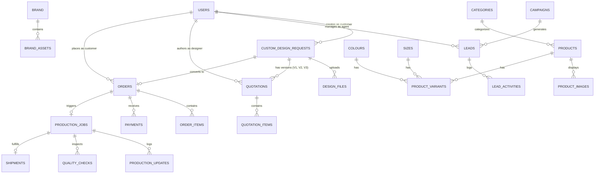

# Database Architecture & Schema Specification

## 1. Overview & Principles

The database layer for **KHADIJA-TUL-QUBRAH BY Meer&Mus** is built on **PostgreSQL 16+**. 
It enforces strict relational integrity, ACID compliance, financial and state auditability, and clear lifecycle versioning.

### Key Architectural Rules
1. **Immutable Quotation History**: Quotations use version numbers (`1`, `2`, `3`...). When revisions are requested, previous versions are preserved untouched.
2. **Strict Foreign Key Constraints**: All relational associations have explicit foreign keys with `ON DELETE RESTRICT` or `ON DELETE CASCADE` where appropriate (e.g. deleting a draft request cascades to files, but deleting an order is blocked if payments or production jobs exist).
3. **Optimistic Locking**: Critical concurrent entities (`orders`, `quotations`, `production_jobs`) maintain a `version` column to prevent lost updates during concurrent edits.
4. **Auditability**: All transactional tables have `created_at`, `updated_at`, and `created_by`/`updated_by` columns.
5. **Decoupled Binary Storage**: Binary media (photos, sketches, pattern sheets) are stored in S3-compatible object storage. The database stores metadata, pre-signed storage keys, MIME types, dimensions, and thumbnail paths.

---

## 2. Core Enumerations

```sql
-- User Roles
CREATE TYPE user_role_enum AS ENUM (
    'SUPER_ADMIN',
    'ADMIN',
    'AGENT',
    'DESIGNER',
    'PRODUCTION',
    'CUSTOMER'
);

-- Custom Request Status Lifecycle
CREATE TYPE custom_request_status_enum AS ENUM (
    'DRAFT',
    'SUBMITTED',
    'UNDER_REVIEW',
    'ASSIGNED',
    'DESIGN_REVIEW',
    'QUOTE_PREPARATION',
    'QUOTE_SENT',
    'REVISION_REQUESTED',
    'QUOTE_ACCEPTED',
    'CONVERTED_TO_ORDER',
    'CANCELLED',
    'REJECTED'
);

-- Quotation Status Lifecycle
CREATE TYPE quotation_status_enum AS ENUM (
    'DRAFT',
    'PENDING_APPROVAL',
    'SENT',
    'REVISION_REQUESTED',
    'ACCEPTED',
    'EXPIRED',
    'SUPERSEDED',
    'REJECTED'
);

-- Order Status Lifecycle
CREATE TYPE order_status_enum AS ENUM (
    'PENDING_PAYMENT',
    'PAID',
    'CONFIRMED',
    'IN_PRODUCTION',
    'QUALITY_CHECK',
    'READY_TO_SHIP',
    'SHIPPED',
    'DELIVERED',
    'CANCELLED',
    'ON_HOLD'
);

-- Production Job Status Lifecycle
CREATE TYPE production_status_enum AS ENUM (
    'NEW',
    'CUTTING',
    'STITCHING',
    'CRAFTING',
    'FINISHING',
    'QUALITY_CHECK',
    'READY',
    'COMPLETED',
    'ON_HOLD'
);

-- Lead Status Lifecycle
CREATE TYPE lead_status_enum AS ENUM (
    'NEW',
    'ASSIGNED',
    'CONTACTED',
    'INTERESTED',
    'CUSTOM_REQUEST',
    'QUOTE_SENT',
    'NEGOTIATION',
    'CONVERTED',
    'LOST',
    'CLOSED'
);

-- Payment Status
CREATE TYPE payment_status_enum AS ENUM (
    'PENDING',
    'AUTHORIZED',
    'CAPTURED',
    'FAILED',
    'REFUNDED',
    'PARTIALLY_REFUNDED'
);
```

---

## 3. Entity-Relationship Overview



---

## 4. Detailed Table Definitions (DDL)

### 4.1 Identity, Users & Roles
```sql
CREATE TABLE users (
    id UUID PRIMARY KEY DEFAULT gen_random_uuid(),
    email VARCHAR(255) UNIQUE NOT NULL,
    phone_number VARCHAR(32) UNIQUE,
    password_hash VARCHAR(255) NOT NULL,
    first_name VARCHAR(128) NOT NULL,
    last_name VARCHAR(128) NOT NULL,
    role user_role_enum NOT NULL DEFAULT 'CUSTOMER',
    is_active BOOLEAN NOT NULL DEFAULT TRUE,
    is_verified BOOLEAN NOT NULL DEFAULT FALSE,
    avatar_url VARCHAR(512),
    refresh_token_hash VARCHAR(255),
    last_login_at TIMESTAMPTZ,
    created_at TIMESTAMPTZ NOT NULL DEFAULT NOW(),
    updated_at TIMESTAMPTZ NOT NULL DEFAULT NOW()
);

CREATE TABLE customer_profiles (
    user_id UUID PRIMARY KEY REFERENCES users(id) ON DELETE CASCADE,
    preferred_currency VARCHAR(3) DEFAULT 'PKR',
    notes TEXT,
    standard_measurements JSONB, -- bust, waist, hips, height, shoulder, armhole, etc.
    created_at TIMESTAMPTZ NOT NULL DEFAULT NOW(),
    updated_at TIMESTAMPTZ NOT NULL DEFAULT NOW()
);

CREATE TABLE agent_profiles (
    user_id UUID PRIMARY KEY REFERENCES users(id) ON DELETE CASCADE,
    department VARCHAR(64) DEFAULT 'SALES',
    max_active_leads INTEGER DEFAULT 30,
    current_active_leads INTEGER DEFAULT 0,
    commission_rate NUMERIC(5,2) DEFAULT 0.00,
    is_available BOOLEAN DEFAULT TRUE,
    created_at TIMESTAMPTZ NOT NULL DEFAULT NOW(),
    updated_at TIMESTAMPTZ NOT NULL DEFAULT NOW()
);
```

### 4.2 Brand & Brand Assets
```sql
CREATE TABLE brand (
    id UUID PRIMARY KEY DEFAULT gen_random_uuid(),
    official_name VARCHAR(255) NOT NULL DEFAULT 'KHADIJA-TUL-QUBRAH BY Meer&Mus',
    primary_display VARCHAR(255) NOT NULL DEFAULT 'KHADIJA-TUL-QUBRAH',
    secondary_signature VARCHAR(255) NOT NULL DEFAULT 'BY Meer&Mus',
    primary_color VARCHAR(16) NOT NULL DEFAULT '#072A20', -- Luxury Emerald Green
    secondary_color VARCHAR(16) NOT NULL DEFAULT '#C5A059', -- Champagne Royal Gold
    accent_color VARCHAR(16) NOT NULL DEFAULT '#FCFBF7', -- Ivory Cream
    support_email VARCHAR(255),
    support_phone VARCHAR(64),
    whatsapp_number VARCHAR(64),
    is_active BOOLEAN NOT NULL DEFAULT TRUE,
    created_at TIMESTAMPTZ NOT NULL DEFAULT NOW(),
    updated_at TIMESTAMPTZ NOT NULL DEFAULT NOW()
);

CREATE TABLE brand_assets (
    id UUID PRIMARY KEY DEFAULT gen_random_uuid(),
    brand_id UUID NOT NULL REFERENCES brand(id) ON DELETE CASCADE,
    asset_type VARCHAR(64) NOT NULL, -- 'LOGO_PRIMARY', 'LOGO_ON_VELVET', 'FAVICON', 'BANNER', 'WATERMARK'
    storage_key VARCHAR(512) NOT NULL,
    cdn_url VARCHAR(1024) NOT NULL,
    mime_type VARCHAR(64) NOT NULL,
    file_size_bytes BIGINT NOT NULL,
    created_at TIMESTAMPTZ NOT NULL DEFAULT NOW()
);
```

### 4.3 Catalog, Fabrics & Craftsmanship
```sql
CREATE TABLE categories (
    id UUID PRIMARY KEY DEFAULT gen_random_uuid(),
    parent_id UUID REFERENCES categories(id) ON DELETE SET NULL,
    name VARCHAR(128) NOT NULL,
    slug VARCHAR(128) UNIQUE NOT NULL,
    description TEXT,
    banner_image_url VARCHAR(1024),
    display_order INTEGER DEFAULT 0,
    is_active BOOLEAN DEFAULT TRUE,
    created_at TIMESTAMPTZ NOT NULL DEFAULT NOW(),
    updated_at TIMESTAMPTZ NOT NULL DEFAULT NOW()
);

CREATE TABLE colours (
    id UUID PRIMARY KEY DEFAULT gen_random_uuid(),
    name VARCHAR(64) NOT NULL,
    hex_code VARCHAR(16) NOT NULL,
    description VARCHAR(255),
    created_at TIMESTAMPTZ NOT NULL DEFAULT NOW()
);

CREATE TABLE sizes (
    id UUID PRIMARY KEY DEFAULT gen_random_uuid(),
    name VARCHAR(32) NOT NULL, -- XS, S, M, L, XL, Custom
    code VARCHAR(16) NOT NULL,
    sort_order INTEGER DEFAULT 0,
    created_at TIMESTAMPTZ NOT NULL DEFAULT NOW()
);

CREATE TABLE size_charts (
    id UUID PRIMARY KEY DEFAULT gen_random_uuid(),
    category_id UUID REFERENCES categories(id) ON DELETE CASCADE,
    title VARCHAR(128) NOT NULL,
    unit VARCHAR(16) DEFAULT 'INCHES', -- 'INCHES' or 'CM'
    measurements_matrix JSONB NOT NULL, -- [{ size: "M", chest: "38", waist: "32", hip: "40" }, ...]
    notes TEXT,
    created_at TIMESTAMPTZ NOT NULL DEFAULT NOW(),
    updated_at TIMESTAMPTZ NOT NULL DEFAULT NOW()
);

CREATE TABLE fabrics (
    id UUID PRIMARY KEY DEFAULT gen_random_uuid(),
    name VARCHAR(128) NOT NULL, -- Raw Silk, Velvet, Organza, Chiffon, Pure Lawn
    description TEXT,
    swatch_image_url VARCHAR(1024),
    base_price_per_meter NUMERIC(10,2) DEFAULT 0.00,
    is_available BOOLEAN DEFAULT TRUE,
    created_at TIMESTAMPTZ NOT NULL DEFAULT NOW(),
    updated_at TIMESTAMPTZ NOT NULL DEFAULT NOW()
);

CREATE TABLE craft_options (
    id UUID PRIMARY KEY DEFAULT gen_random_uuid(),
    name VARCHAR(128) NOT NULL, -- Zardozi, Resham Embroidery, Crochet, Hand Block Print, Applique, Gotta Patti
    craft_category VARCHAR(64), -- EMBROIDERY, HANDWORK, TEXTILE_MANIPULATION, PRINTING
    description TEXT,
    sample_image_url VARCHAR(1024),
    estimated_days INTEGER DEFAULT 7,
    is_active BOOLEAN DEFAULT TRUE,
    created_at TIMESTAMPTZ NOT NULL DEFAULT NOW(),
    updated_at TIMESTAMPTZ NOT NULL DEFAULT NOW()
);

CREATE TABLE products (
    id UUID PRIMARY KEY DEFAULT gen_random_uuid(),
    category_id UUID REFERENCES categories(id) ON DELETE SET NULL,
    name VARCHAR(255) NOT NULL,
    slug VARCHAR(255) UNIQUE NOT NULL,
    sku VARCHAR(64) UNIQUE NOT NULL,
    description TEXT,
    base_price NUMERIC(12,2) NOT NULL,
    is_customizable BOOLEAN DEFAULT TRUE,
    is_active BOOLEAN DEFAULT TRUE,
    size_chart_id UUID REFERENCES size_charts(id) ON DELETE SET NULL,
    tags TEXT[],
    created_at TIMESTAMPTZ NOT NULL DEFAULT NOW(),
    updated_at TIMESTAMPTZ NOT NULL DEFAULT NOW()
);

CREATE TABLE product_images (
    id UUID PRIMARY KEY DEFAULT gen_random_uuid(),
    product_id UUID NOT NULL REFERENCES products(id) ON DELETE CASCADE,
    storage_key VARCHAR(512) NOT NULL,
    image_url VARCHAR(1024) NOT NULL,
    thumbnail_url VARCHAR(1024),
    sort_order INTEGER DEFAULT 0,
    is_primary BOOLEAN DEFAULT FALSE,
    created_at TIMESTAMPTZ NOT NULL DEFAULT NOW()
);

CREATE TABLE product_variants (
    id UUID PRIMARY KEY DEFAULT gen_random_uuid(),
    product_id UUID NOT NULL REFERENCES products(id) ON DELETE CASCADE,
    colour_id UUID REFERENCES colours(id) ON DELETE RESTRICT,
    size_id UUID REFERENCES sizes(id) ON DELETE RESTRICT,
    sku VARCHAR(128) UNIQUE NOT NULL,
    stock_quantity INTEGER NOT NULL DEFAULT 0,
    price_adjustment NUMERIC(10,2) DEFAULT 0.00,
    is_active BOOLEAN DEFAULT TRUE,
    created_at TIMESTAMPTZ NOT NULL DEFAULT NOW(),
    updated_at TIMESTAMPTZ NOT NULL DEFAULT NOW()
);
```

### 4.4 Custom Design Requests & Design Files
```sql
CREATE TABLE custom_design_requests (
    id UUID PRIMARY KEY DEFAULT gen_random_uuid(),
    request_number VARCHAR(32) UNIQUE NOT NULL, -- CDR-202609-0001
    customer_id UUID NOT NULL REFERENCES users(id) ON DELETE RESTRICT,
    referenced_product_id UUID REFERENCES products(id) ON DELETE SET NULL,
    assigned_agent_id UUID REFERENCES users(id) ON DELETE SET NULL,
    assigned_designer_id UUID REFERENCES users(id) ON DELETE SET NULL,
    
    status custom_request_status_enum NOT NULL DEFAULT 'DRAFT',
    
    -- Custom Selection specifications
    colour_preference VARCHAR(128),
    colour_id UUID REFERENCES colours(id) ON DELETE SET NULL,
    fabric_id UUID REFERENCES fabrics(id) ON DELETE SET NULL,
    craft_option_ids UUID[] DEFAULT '{}',
    
    -- Measurements
    sizing_mode VARCHAR(32) NOT NULL DEFAULT 'STANDARD', -- 'STANDARD' or 'CUSTOM'
    standard_size_id UUID REFERENCES sizes(id) ON DELETE SET NULL,
    custom_measurements JSONB, -- { bust, waist, hips, shirt_length, shoulder, sleeve_length, inseam, etc. }
    
    design_notes TEXT,
    customer_budget NUMERIC(12,2),
    expected_delivery_date DATE,
    
    created_at TIMESTAMPTZ NOT NULL DEFAULT NOW(),
    updated_at TIMESTAMPTZ NOT NULL DEFAULT NOW()
);

CREATE TABLE design_files (
    id UUID PRIMARY KEY DEFAULT gen_random_uuid(),
    custom_request_id UUID NOT NULL REFERENCES custom_design_requests(id) ON DELETE CASCADE,
    uploaded_by UUID NOT NULL REFERENCES users(id) ON DELETE RESTRICT,
    file_type VARCHAR(64) NOT NULL, -- 'INSPIRATION_IMAGE', 'DESIGN_SKETCH', 'MEASUREMENT_SHEET', 'FABRIC_SWATCH'
    storage_key VARCHAR(512) NOT NULL,
    file_name VARCHAR(255) NOT NULL,
    file_size_bytes BIGINT NOT NULL,
    mime_type VARCHAR(128) NOT NULL,
    thumbnail_key VARCHAR(512),
    created_at TIMESTAMPTZ NOT NULL DEFAULT NOW()
);
```

### 4.5 Quotations & Immutable Versioning
```sql
CREATE TABLE quotations (
    id UUID PRIMARY KEY DEFAULT gen_random_uuid(),
    custom_request_id UUID NOT NULL REFERENCES custom_design_requests(id) ON DELETE RESTRICT,
    version_number INTEGER NOT NULL, -- 1, 2, 3...
    quote_number VARCHAR(64) UNIQUE NOT NULL, -- QUOTE-CDR-202609-0001-V1
    created_by UUID NOT NULL REFERENCES users(id) ON DELETE RESTRICT,
    
    status quotation_status_enum NOT NULL DEFAULT 'DRAFT',
    subtotal_amount NUMERIC(12,2) NOT NULL DEFAULT 0.00,
    fabric_cost NUMERIC(12,2) NOT NULL DEFAULT 0.00,
    craftsmanship_cost NUMERIC(12,2) NOT NULL DEFAULT 0.00,
    stitching_cost NUMERIC(12,2) NOT NULL DEFAULT 0.00,
    discount_amount NUMERIC(12,2) NOT NULL DEFAULT 0.00,
    tax_amount NUMERIC(12,2) NOT NULL DEFAULT 0.00,
    shipping_amount NUMERIC(12,2) NOT NULL DEFAULT 0.00,
    total_amount NUMERIC(12,2) NOT NULL DEFAULT 0.00,
    currency VARCHAR(3) NOT NULL DEFAULT 'PKR',
    
    estimated_production_days INTEGER NOT NULL DEFAULT 14,
    designer_notes TEXT,
    customer_change_request_notes TEXT,
    valid_until TIMESTAMPTZ NOT NULL,
    sent_at TIMESTAMPTZ,
    accepted_at TIMESTAMPTZ,
    
    created_at TIMESTAMPTZ NOT NULL DEFAULT NOW(),
    updated_at TIMESTAMPTZ NOT NULL DEFAULT NOW(),
    
    CONSTRAINT uq_request_version UNIQUE (custom_request_id, version_number)
);

CREATE TABLE quotation_items (
    id UUID PRIMARY KEY DEFAULT gen_random_uuid(),
    quotation_id UUID NOT NULL REFERENCES quotations(id) ON DELETE CASCADE,
    item_title VARCHAR(255) NOT NULL,
    item_type VARCHAR(64) NOT NULL, -- 'BASE_GARMENT', 'FABRIC', 'EMBROIDERY_FRONT', 'LACE_FINISHING', 'STITCHING'
    description TEXT,
    quantity INTEGER NOT NULL DEFAULT 1,
    unit_price NUMERIC(12,2) NOT NULL,
    line_total NUMERIC(12,2) NOT NULL,
    created_at TIMESTAMPTZ NOT NULL DEFAULT NOW()
);
```

### 4.6 Orders, Payments & Addresses
```sql
CREATE TABLE addresses (
    id UUID PRIMARY KEY DEFAULT gen_random_uuid(),
    user_id UUID NOT NULL REFERENCES users(id) ON DELETE CASCADE,
    address_title VARCHAR(64) DEFAULT 'Home',
    recipient_name VARCHAR(128) NOT NULL,
    phone_number VARCHAR(32) NOT NULL,
    address_line1 VARCHAR(255) NOT NULL,
    address_line2 VARCHAR(255),
    city VARCHAR(128) NOT NULL,
    state_province VARCHAR(128),
    postal_code VARCHAR(32),
    country VARCHAR(64) NOT NULL DEFAULT 'Pakistan',
    is_default_shipping BOOLEAN DEFAULT FALSE,
    is_default_billing BOOLEAN DEFAULT FALSE,
    created_at TIMESTAMPTZ NOT NULL DEFAULT NOW(),
    updated_at TIMESTAMPTZ NOT NULL DEFAULT NOW()
);

CREATE TABLE orders (
    id UUID PRIMARY KEY DEFAULT gen_random_uuid(),
    order_number VARCHAR(64) UNIQUE NOT NULL, -- ORD-202609-0001
    customer_id UUID NOT NULL REFERENCES users(id) ON DELETE RESTRICT,
    origin_custom_request_id UUID REFERENCES custom_design_requests(id) ON DELETE SET NULL,
    accepted_quotation_id UUID REFERENCES quotations(id) ON DELETE SET NULL,
    
    status order_status_enum NOT NULL DEFAULT 'PENDING_PAYMENT',
    payment_status payment_status_enum NOT NULL DEFAULT 'PENDING',
    
    subtotal_amount NUMERIC(12,2) NOT NULL,
    discount_amount NUMERIC(12,2) DEFAULT 0.00,
    tax_amount NUMERIC(12,2) DEFAULT 0.00,
    shipping_amount NUMERIC(12,2) DEFAULT 0.00,
    total_amount NUMERIC(12,2) NOT NULL,
    currency VARCHAR(3) NOT NULL DEFAULT 'PKR',
    
    shipping_address_id UUID REFERENCES addresses(id) ON DELETE RESTRICT,
    billing_address_id UUID REFERENCES addresses(id) ON DELETE RESTRICT,
    
    order_notes TEXT,
    confirmed_at TIMESTAMPTZ,
    cancelled_at TIMESTAMPTZ,
    cancellation_reason TEXT,
    
    created_at TIMESTAMPTZ NOT NULL DEFAULT NOW(),
    updated_at TIMESTAMPTZ NOT NULL DEFAULT NOW()
);

CREATE TABLE order_items (
    id UUID PRIMARY KEY DEFAULT gen_random_uuid(),
    order_id UUID NOT NULL REFERENCES orders(id) ON DELETE CASCADE,
    product_variant_id UUID REFERENCES product_variants(id) ON DELETE SET NULL,
    custom_request_id UUID REFERENCES custom_design_requests(id) ON DELETE SET NULL,
    item_title VARCHAR(255) NOT NULL,
    sku VARCHAR(128),
    unit_price NUMERIC(12,2) NOT NULL,
    quantity INTEGER NOT NULL DEFAULT 1,
    line_total NUMERIC(12,2) NOT NULL,
    specifications JSONB, -- Snapshot of sizing, measurements, fabric and crafts
    created_at TIMESTAMPTZ NOT NULL DEFAULT NOW()
);

CREATE TABLE payments (
    id UUID PRIMARY KEY DEFAULT gen_random_uuid(),
    order_id UUID NOT NULL REFERENCES orders(id) ON DELETE RESTRICT,
    transaction_reference VARCHAR(128) UNIQUE NOT NULL,
    payment_gateway VARCHAR(64) NOT NULL, -- 'STRIPE', 'BANK_TRANSFER', 'COD', 'EASYPAISA', 'JAZZCASH'
    amount NUMERIC(12,2) NOT NULL,
    currency VARCHAR(3) NOT NULL DEFAULT 'PKR',
    status payment_status_enum NOT NULL DEFAULT 'PENDING',
    gateway_response JSONB,
    paid_at TIMESTAMPTZ,
    created_at TIMESTAMPTZ NOT NULL DEFAULT NOW(),
    updated_at TIMESTAMPTZ NOT NULL DEFAULT NOW()
);
```

### 4.7 Production, Quality Control & Shipments
```sql
CREATE TABLE production_jobs (
    id UUID PRIMARY KEY DEFAULT gen_random_uuid(),
    job_number VARCHAR(64) UNIQUE NOT NULL, -- PRD-202609-0001
    order_id UUID NOT NULL REFERENCES orders(id) ON DELETE RESTRICT,
    order_item_id UUID NOT NULL REFERENCES order_items(id) ON DELETE RESTRICT,
    
    status production_status_enum NOT NULL DEFAULT 'NEW',
    assigned_manager_id UUID REFERENCES users(id) ON DELETE SET NULL,
    
    target_cutting_date DATE,
    target_stitching_date DATE,
    target_crafting_date DATE,
    target_completion_date DATE,
    actual_completion_date TIMESTAMPTZ,
    
    production_notes TEXT,
    created_at TIMESTAMPTZ NOT NULL DEFAULT NOW(),
    updated_at TIMESTAMPTZ NOT NULL DEFAULT NOW()
);

CREATE TABLE production_updates (
    id UUID PRIMARY KEY DEFAULT gen_random_uuid(),
    production_job_id UUID NOT NULL REFERENCES production_jobs(id) ON DELETE CASCADE,
    recorded_by UUID NOT NULL REFERENCES users(id) ON DELETE RESTRICT,
    stage production_status_enum NOT NULL,
    notes TEXT,
    photo_storage_keys TEXT[] DEFAULT '{}',
    created_at TIMESTAMPTZ NOT NULL DEFAULT NOW()
);

CREATE TABLE quality_checks (
    id UUID PRIMARY KEY DEFAULT gen_random_uuid(),
    production_job_id UUID NOT NULL REFERENCES production_jobs(id) ON DELETE RESTRICT,
    inspector_id UUID NOT NULL REFERENCES users(id) ON DELETE RESTRICT,
    is_passed BOOLEAN NOT NULL DEFAULT FALSE,
    measurement_accuracy_verified BOOLEAN DEFAULT FALSE,
    fabric_finish_verified BOOLEAN DEFAULT FALSE,
    embroidery_accuracy_verified BOOLEAN DEFAULT FALSE,
    stitching_density_verified BOOLEAN DEFAULT FALSE,
    defect_notes TEXT,
    inspection_photos TEXT[] DEFAULT '{}',
    inspected_at TIMESTAMPTZ NOT NULL DEFAULT NOW()
);

CREATE TABLE shipments (
    id UUID PRIMARY KEY DEFAULT gen_random_uuid(),
    order_id UUID NOT NULL REFERENCES orders(id) ON DELETE RESTRICT,
    tracking_number VARCHAR(128) NOT NULL,
    courier_name VARCHAR(128) NOT NULL, -- 'DHL', 'FEDEX', 'TCS', 'LEOPARDS'
    shipping_label_url VARCHAR(1024),
    status VARCHAR(64) NOT NULL DEFAULT 'LABEL_CREATED',
    shipped_at TIMESTAMPTZ,
    delivered_at TIMESTAMPTZ,
    tracking_events JSONB DEFAULT '[]',
    created_at TIMESTAMPTZ NOT NULL DEFAULT NOW(),
    updated_at TIMESTAMPTZ NOT NULL DEFAULT NOW()
);
```

### 4.8 Campaigns, Leads & Agent CRM
```sql
CREATE TABLE campaigns (
    id UUID PRIMARY KEY DEFAULT gen_random_uuid(),
    title VARCHAR(255) NOT NULL,
    utm_source VARCHAR(64),
    utm_medium VARCHAR(64),
    utm_campaign VARCHAR(128) UNIQUE NOT NULL,
    start_date DATE,
    end_date DATE,
    allocated_budget NUMERIC(12,2) DEFAULT 0.00,
    is_active BOOLEAN DEFAULT TRUE,
    created_at TIMESTAMPTZ NOT NULL DEFAULT NOW(),
    updated_at TIMESTAMPTZ NOT NULL DEFAULT NOW()
);

CREATE TABLE leads (
    id UUID PRIMARY KEY DEFAULT gen_random_uuid(),
    lead_number VARCHAR(64) UNIQUE NOT NULL, -- LEAD-202609-0001
    campaign_id UUID REFERENCES campaigns(id) ON DELETE SET NULL,
    customer_id UUID REFERENCES users(id) ON DELETE SET NULL,
    assigned_agent_id UUID REFERENCES users(id) ON DELETE SET NULL,
    
    lead_source VARCHAR(64) NOT NULL DEFAULT 'ORGANIC_WEB', -- 'INSTAGRAM', 'FACEBOOK', 'WHATSAPP', 'DIRECT', 'REFERRAL'
    status lead_status_enum NOT NULL DEFAULT 'NEW',
    priority VARCHAR(16) DEFAULT 'MEDIUM', -- 'LOW', 'MEDIUM', 'HIGH', 'VIP'
    
    first_name VARCHAR(128),
    last_name VARCHAR(128),
    contact_phone VARCHAR(32) NOT NULL,
    contact_email VARCHAR(255),
    inquiry_message TEXT,
    estimated_value NUMERIC(12,2),
    converted_at TIMESTAMPTZ,
    
    created_at TIMESTAMPTZ NOT NULL DEFAULT NOW(),
    updated_at TIMESTAMPTZ NOT NULL DEFAULT NOW()
);

CREATE TABLE lead_activities (
    id UUID PRIMARY KEY DEFAULT gen_random_uuid(),
    lead_id UUID NOT NULL REFERENCES leads(id) ON DELETE CASCADE,
    agent_id UUID NOT NULL REFERENCES users(id) ON DELETE RESTRICT,
    activity_type VARCHAR(64) NOT NULL, -- 'CALL', 'WHATSAPP_CHAT', 'EMAIL', 'MEETING', 'NOTE', 'QUOTE_SENT'
    summary VARCHAR(255) NOT NULL,
    detailed_notes TEXT,
    scheduled_at TIMESTAMPTZ,
    completed_at TIMESTAMPTZ,
    created_at TIMESTAMPTZ NOT NULL DEFAULT NOW()
);
```

### 4.9 Notifications & Audit Logs
```sql
CREATE TABLE notifications (
    id UUID PRIMARY KEY DEFAULT gen_random_uuid(),
    user_id UUID NOT NULL REFERENCES users(id) ON DELETE CASCADE,
    title VARCHAR(255) NOT NULL,
    body TEXT NOT NULL,
    channel VARCHAR(32) NOT NULL DEFAULT 'IN_APP', -- 'IN_APP', 'EMAIL', 'SMS', 'WHATSAPP', 'PUSH'
    entity_type VARCHAR(64), -- 'CUSTOM_REQUEST', 'QUOTATION', 'ORDER', 'PRODUCTION'
    entity_id UUID,
    is_read BOOLEAN NOT NULL DEFAULT FALSE,
    read_at TIMESTAMPTZ,
    created_at TIMESTAMPTZ NOT NULL DEFAULT NOW()
);

CREATE TABLE audit_logs (
    id UUID PRIMARY KEY DEFAULT gen_random_uuid(),
    actor_id UUID REFERENCES users(id) ON DELETE SET NULL,
    action VARCHAR(128) NOT NULL,
    entity_table VARCHAR(64) NOT NULL,
    entity_id UUID NOT NULL,
    previous_state JSONB,
    new_state JSONB,
    ip_address VARCHAR(45),
    user_agent TEXT,
    created_at TIMESTAMPTZ NOT NULL DEFAULT NOW()
);
```

---

## 5. Critical Database Indexes

```sql
CREATE INDEX idx_products_category ON products(category_id) WHERE is_active = TRUE;
CREATE INDEX idx_products_slug ON products(slug);
CREATE INDEX idx_product_variants_lookup ON product_variants(product_id, colour_id, size_id);

CREATE INDEX idx_custom_requests_customer ON custom_design_requests(customer_id);
CREATE INDEX idx_custom_requests_status ON custom_design_requests(status);
CREATE INDEX idx_custom_requests_agent ON custom_design_requests(assigned_agent_id);
CREATE INDEX idx_custom_requests_designer ON custom_design_requests(assigned_designer_id);

CREATE INDEX idx_quotations_request ON quotations(custom_request_id, version_number DESC);

CREATE INDEX idx_orders_customer ON orders(customer_id);
CREATE INDEX idx_orders_status ON orders(status);

CREATE INDEX idx_production_jobs_order ON production_jobs(order_id);
CREATE INDEX idx_production_jobs_status ON production_jobs(status);

CREATE INDEX idx_leads_agent ON leads(assigned_agent_id);
CREATE INDEX idx_leads_status ON leads(status);

CREATE INDEX idx_notifications_user_unread ON notifications(user_id) WHERE is_read = FALSE;
CREATE INDEX idx_audit_logs_entity ON audit_logs(entity_table, entity_id);
```
