# Phased Engineering Roadmap & Quality Gates

## 1. Development Principles & Quality Verification Standard

Every engineering phase follows an uncompromising 16-step execution lifecycle:
```
 1. Analyze Requirements ────────► 2. Inspect Repository ────────► 3. Update Architecture Docs
           │                                                                 │
 6. Run Linting Checks   ◄──────── 5. Run Type Checking  ◄──────── 4. Implement Phase Code
           │
 7. Run Unit Tests       ────────► 8. Integration Tests  ────────► 9. Test DB Migrations
           │                                                                 │
 12. Auth/RBAC Tests     ◄──────── 11. Full-Stack Tests  ◄──────── 10. Test API Endpoints
           │
 13. Fix All Failures    ────────► 14. Manual E2E Verify ────────► 15. Document Delivery
                                                                             │
                                                                   16. Proceed to Next Phase
```

### Uncompromising Rules:
- **No Mock APIs**: Services must communicate with active database instances and functional backend endpoints.
- **No Silent Test Skips**: 100% test pass rate required prior to advancing any phase.
- **Strict Separation of Seed vs Production Data**: Seed scripts populate rich realistic data for luxury fashion testing without polluting production migrations.

---

## 2. Phase Breakdown

```mermaid
flowchart LR
    P1["Phase 1\nFoundation"] --> P2["Phase 2\nAuth & RBAC"]
    P2 --> P3["Phase 3\nCatalog & Brand"]
    P3 --> P4["Phase 4\nCustom Design"]
    P4 --> P5["Phase 5\nQuotations"]
    P5 --> P6["Phase 6\nOrders & Payments"]
    P6 --> P7["Phase 7\nProduction & QC"]
    P7 --> P8["Phase 8\nCRM & Leads"]
    P8 --> P9["Phase 9\nCampaign Management"]
    P9 --> P10["Phase 10\nReal-Time & Notifications"]
    P10 --> P11["Phase 11\nStaff Web Panel"]
    P11 --> P12["Phase 12\nCustomer App"]
    P12 --> P13["Phase 13\nLaunch Readiness"]
```



---

### Phase 0: Project Workspace, Tooling & Infrastructure Setup
- **Objectives**: Initialize monorepo or structured workspace directory layout (`/backend`, `/frontend-admin`, `/mobile-customer`, `/docs`).
- **Deliverables**:
  - Containerization setup (`docker-compose.yml`) for local PostgreSQL 16, Redis 7, and MinIO (local S3).
  - NestJS backend initialization with TypeScript, ESLint, Prettier, Jest, and configuration management.
  - Environment variable schema validation via Joi / Zod (`.env.example`).
  - Git repository structure and branch policies.

### Phase 1: Foundation (Backend, Multi-App Workspaces, Data Infrastructure & Health) [COMPLETED]
- **Objectives**: Implement the core engineering foundation across backend, admin web portal, customer mobile app, PostgreSQL, Redis, Docker, health checking, and CI.
- **Implemented Deliverables**:
  1. **NestJS Backend Architecture**: Initialized with all 22 domain modules (`auth`, `brand`, `users`, `products`, `categories`, `colours`, `sizes`, `size-charts`, `fabrics`, `craft-options`, `custom-design`, `quotations`, `orders`, `payments`, `production`, `crm`, `leads`, `campaigns`, `agents`, `notifications`, `analytics`, `admin`, plus `health`).
  2. **Next.js 14+ Frontend Admin Portal**: Created in `frontend-admin/` with role-specific views (`/admin`, `/agent`, `/designer`, `/production`) and live backend health monitor.
  3. **Flutter Customer Mobile App**: Created in `mobile-customer/` featuring emerald & gold luxury branding, catalog discovery, and bespoke "Create Your Own" design workflow.
  4. **PostgreSQL 16 Connection**: Managed via Prisma ORM with connection pooling and lifecycle hooks.
  5. **Redis 7 Connection**: Implemented in `backend/src/redis/redis.service.ts` with graceful retry strategy and health ping.
  6. **Health Check Endpoint**: `GET /api/v1/health` providing real-time database and Redis ping, response times, uptime, and system status.
  7. **Docker Configuration**: `docker-compose.yml` for PostgreSQL 16 and Redis 7.
  8. **Migration & Rollback**: `0_init/migration.sql` and `rollback.sql`.
  9. **Seed Engine**: `prisma/seed.ts` populating brand identity, test accounts across all 6 roles, master categories, colours, sizes, fabrics, and crafts.
  10. **Swagger OpenAPI**: Live API documentation configured at `/api/docs`.
  11. **Security & Validation**: Standardized global `AllExceptionsFilter`, `TransformInterceptor`, `ValidationPipe`, JWT strategy, and `RolesGuard`.
  12. **Continuous Integration**: `.github/workflows/ci.yml` for linting, typechecking, and test execution.


### Phase 2: Authentication & Role-Based Access Control (RBAC) [COMPLETED]
- **Objectives**: Production-ready authentication across all 6 roles (`CUSTOMER`, `AGENT`, `DESIGNER`, `PRODUCTION`, `ADMIN`, `SUPER_ADMIN`), password reset, audit logging, and data isolation guards.
- **Implemented Deliverables**:
  - Full authentication lifecycle: Registration, Dual-Identifier Login (email/phone), Refresh Token Rotation, Logout session revocation.
  - Password Management: Bcrypt hashing, Forgot Password with one-hour secure reset token generation, Reset Password with session revocation.
  - Current User endpoint: `GET /api/v1/auth/me` returning detailed profile and permissions.
  - Multi-Tenant RBAC & Isolation Guards:
    - `RolesGuard`: Role verification with `SUPER_ADMIN` system-wide override.
    - `CustomerOwnershipGuard`: Enforces customer isolation boundary (strictly blocks access to other customers' data).
    - `AgentAccessGuard`: Enforces agent isolation boundary (restricts agents strictly to assigned leads).
    - `DesignerAccessGuard`: Restricts designers strictly to assigned custom design requests and client sketches.
    - `ProductionAccessGuard`: Restricts workshop floor jobs to atelier personnel and administration.
  - Audit Logging Engine: `AuditService` logging sensitive actions (`LOGIN_SUCCESS`, `LOGIN_FAILED`, `USER_REGISTER`, `USER_LOGOUT`, `PASSWORD_RESET_REQUESTED`, `PASSWORD_RESET_SUCCESS`) to `audit_logs`.
  - Comprehensive Test Suite:
    - `auth.service.spec.ts`: Valid login, invalid login, expired token, refresh token, forgot/reset password, and audit tracking.
    - `roles.guard.spec.ts`: Role restrictions, admin access, super admin overrides.
    - `customer-ownership.guard.spec.ts`: Customer self-access allowed, unauthorized customer cross-access rejected.
    - `agent-access.guard.spec.ts`: Assigned lead allowed, unassigned lead access blocked with ForbiddenException.
    - `designer-access.guard.spec.ts`: Assigned design request allowed, unassigned request blocked.
    - `production-access.guard.spec.ts`: Production floor restricted to atelier & admin roles.

### Phase 3: Brand Identity, Luxury Catalog & Master Data Management [COMPLETED]
- **Objectives**: Full implementation of Brand Management, Brand Assets, Categories, Products, Product Images, Colours, Sizes, Size Charts, Fabrics, Craft Options, Product Variants, and Inventory.
- **Implemented Deliverables**:
  - **Brand System**: Centralized brand entity and assets (`KHADIJAH-TUL-QUBRAH by Meer&Mus`) with official logos and color tokens (`#072A20`, `#C5A059`, `#FCFBF7`).
  - **Categories Module** (`/api/v1/categories`): Hierarchical categories with banner images, slugs, display orders, and soft deletion.
  - **Colours Module** (`/api/v1/colours`): Master signature palette with hex codes and descriptions.
  - **Sizes Module** (`/api/v1/sizes`): Standard sizes (XS to XL, Custom) with sort orders.
  - **Size Charts Module** (`/api/v1/size-charts`): Multi-point category measurement matrices (chest, waist, hip, shoulder, etc.) in inches/cm.
  - **Fabrics Module** (`/api/v1/fabrics`): Haute couture fabric library (Micro Velvet 9000, Pure Katan Silk, Organza, Jamawar, Chiffon) with per-meter pricing and swatches.
  - **Craft Options Module** (`/api/v1/craft-options`): Artisanal embellishments (Zardozi, Resham Silk, Crochet, Gotta Patti, Block Print) with estimated turnaround days.
  - **Products & Variants Module** (`/api/v1/products`):
    - Admin creation with auto-generated slugs and SKUs, initial variants, and image gallery.
    - Price modification, category linking, size chart assignment, customization flag toggles.
    - Soft-disable functionality (`isActive = false`) removing products immediately from public customer view.
    - Multi-variant management with individual SKU tracking and inventory stock levels.
    - Customer search, category filtering, price range filtering, colour/size variant lookup, and pagination.
  - **Test Verification**:
    - `products.service.spec.ts`: Tests product creation through admin, customer appearance, price updates reflected to customer, product disabling hiding from customer, variant creation, SKU uniqueness, inventory stock updates, and image gallery management.
    - `categories.service.spec.ts`: Tests category tree browsing and creation.
    - `fabrics.service.spec.ts`: Tests fabric listing and per-meter price updating.

### Phase 4: "Create Your Own" Custom Design Studio & S3 Object Storage [COMPLETED]
- **Objectives**: Build the complete 10-step bespoke "Create Your Own" custom design intake engine, configurable measurement templates, and decoupled S3 object storage with pre-signed upload URLs and signed 15-minute download URLs.
- **Implemented Deliverables**:
  - **Prisma Data Models**:
    - `CustomDesignRequest`: Core custom request entity supporting referenced product linking or standalone "My Own Design", colour preference/ID, fabric selection, artisanal craft options, sizing mode (`STANDARD` vs `CUSTOM`), standard size ID, `MeasurementTemplate` linking, dynamic JSON `customMeasurements`, design notes, customer budget, expected delivery date, assigned agent/designer, and workflow status (`DRAFT`, `SUBMITTED`, `UNDER_REVIEW`, `QUOTATION_DRAFTED`, `QUOTATION_SENT`, `REVISION_REQUESTED`, `ACCEPTED`, `ORDER_CREATED`, `CANCELLED`).
    - `DesignFile`: File metadata referencing S3 storage keys, thumbnail keys, MIME types, BigInt file size bytes, file types (`INSPIRATION`, `SKETCH`, `SPECIFICATION`, `FINAL_ARTWORK`), and customer/designer upload attribution.
    - `MeasurementTemplate`: Dynamic, configurable measurement templates (e.g. Bridal Lehenga, Peshwas, Sherwani, Maxi) with extensible JSON field definitions (`chest`, `waist`, `hip`, `length`, `shoulder`, `sleeve`, etc.) so fields are never hardcoded.
  - **S3 / Object Storage Service** (`backend/src/common/services/storage.service.ts`):
    - Multi-tenant folder segregation (`custom-requests/{requestId}/`).
    - Pre-signed upload URL generation with 15-minute expiration (`AWS S3` / `MinIO`).
    - Signed secure download and thumbnail URLs protecting customer media from public scraping.
    - File validation: strict MIME types (`image/jpeg`, `image/png`, `image/webp`, `application/pdf`) and 25MB max size limit.
  - **Custom Design REST API** (`/api/v1/custom-design`):
    - `POST /api/v1/custom-design/requests`: Create custom design draft with unique human-readable sequence numbers (e.g., `CDR-202609-0001`). Validates custom measurements payload if `sizingMode` is `CUSTOM`.
    - `POST /api/v1/custom-design/requests/:id/files`: Validates file upload, creates `DesignFile` record, returns presigned upload URL and signed download URLs.
    - `GET /api/v1/custom-design/requests/:id/files`: Lists files attached to request with fresh signed download and thumbnail URLs.
    - `GET /api/v1/custom-design/requests/:id`: Retrieves detailed request with linked product, colour, fabric, measurement template, quotations, and signed file URLs.
    - `PATCH /api/v1/custom-design/requests/:id`: Updates request. Enforces submission lock (customer cannot modify request once status is `SUBMITTED`, unless in `REVISION_REQUESTED` state).
    - `POST /api/v1/custom-design/requests/:id/submit`: Submits draft request, transitions status to `SUBMITTED`, locks draft edits, and records `CUSTOM_REQUEST_SUBMITTED` audit action.
    - `GET /api/v1/custom-design/requests`: Filtered listing respecting RBAC data boundaries (`CUSTOMER` sees only their own requests; `AGENT` sees assigned requests; `DESIGNER` sees assigned or unassigned submitted requests for pickup; `ADMIN` sees all).
    - `GET /api/v1/custom-design/measurement-templates`: Lists active configurable garment measurement templates.
    - `POST /api/v1/custom-design/measurement-templates`: Allows Admin/Designer to create new measurement templates.
  - **Unit Test Suite** (`backend/src/modules/custom-design/custom-design.service.spec.ts`):
    - `1. Customer creates custom design request (Draft)`: Tests draft creation, unique number formatting, measurement requirement enforcement, and audit logging.
    - `2. Upload inspiration image with S3 pre-signed URL & DB metadata`: Tests MIME validation, 25MB limit, database metadata persistence, presigned upload URL and signed download URL generation.
    - `3. Customer Isolation & Access Security`: Verifies Customer A cannot view or upload files to Customer B's request (throws `ForbiddenException`).
    - `4. Submit request and advance status to SUBMITTED`: Tests transition from `DRAFT` to `SUBMITTED`, locks subsequent resubmission (`BadRequestException`), logs audit trail.
    - `5. Designer and Admin Visibility`: Tests Designer pickup visibility for submitted requests and full Admin oversight.
    - `6. Customer Modification Lock`: Verifies submitted request throws `BadRequestException` when customer attempts direct edits, but permits edits when status is `REVISION_REQUESTED`.
    - `7. Configurable Measurement Templates`: Tests template listing and creation with extensible JSON fields.

### Phase 5: Designer Dashboard & Quotation Engine (Multi-Version V1, V2, V3...) [COMPLETED]
- **Objectives**: Build the full Haute Couture Designer Dashboard, 6 operational queues, server-side totals calculation engine, mandatory immutable multi-versioning (V1, V2, V3...), revision negotiation workflow, customer quote acceptance, and automatic Order & OrderItem generation.
- **Implemented Deliverables**:
  - **Prisma Schema Enhancements**:
    - `CustomRequestStatus`: Added `CLARIFICATION_REQUESTED` state.
    - `CustomDesignRequest`: Added `clarificationNotes` for designer-to-client queries.
    - `Quotation`: Enriched with `customizationFee`, `deliveryFee`, `estimatedMinDays`, `estimatedMaxDays`, `designerNotes`, `customerChangeRequestNotes`, `validUntil`, `sentAt`, `acceptedAt`.
    - `QuotationItem`: Granular line items linking to quotations with `itemTitle`, `itemType`, `description`, `quantity`, `unitPrice`, `lineTotal`.
  - **Server-Side Calculated Costing Architecture**:
    - Never trusts client-submitted totals.
    - Calculates line totals `quantity * unitPrice`, `subtotalAmount = sum(lineTotals)`.
    - Computes `totalAmount = subtotalAmount + customizationFee + deliveryFee + taxAmount - discountAmount`.
  - **Immutable Multi-Versioning Workflow**:
    - Queries max version for custom request; increments version (`V1` &rarr; `V2` &rarr; `V3`).
    - Format: `QT-${cleanRequestNumber}-V${nextVersion}`.
    - **Previous quotes are NEVER overwritten or mutated**. Historical quotes remain preserved with their exact prices, items, notes, and statuses.
  - **Customer Actions & Revision Loop**:
    - `POST /api/v1/quotations/:id/accept`: Validates caller is request owner and quote is `SENT`. Marks quote as `ACCEPTED`, marks all prior quote versions as `SUPERSEDED`, advances custom request to `QUOTE_ACCEPTED` and `CONVERTED_TO_ORDER`, and automatically creates an `Order` and `OrderItems` with status `PENDING_PAYMENT`.
    - `POST /api/v1/quotations/:id/request-changes`: Customer submits revision notes; transitions quote and custom request status to `REVISION_REQUESTED`.
    - `POST /api/v1/quotations/:id/reject`: Rejects quotation with customer reasoning.
  - **Designer Operations & Dashboard**:
    - `GET /api/v1/designer/dashboard`: Real-time queue aggregator providing metrics and lists for:
      1. `newRequests` (Unassigned submitted requests ready for pickup).
      2. `assignedRequests` (Active requests in design review).
      3. `clarificationRequests` (Pending customer clarification responses).
      4. `quotationPreparation` (Quotes currently being drafted).
      5. `revisionRequests` (Customer requested change requests awaiting V2+).
      6. `completedQuotes` (Accepted quotes converted into atelier orders).
    - `POST /api/v1/custom-requests/:id/accept-job`: Designer self-assignment for incoming requests.
    - `POST /api/v1/custom-requests/:id/request-clarification`: Inquires clarifications on fabrics, swatches, or measurements.
    - `POST /api/v1/custom-requests/:id/quotations`: Creates quotation V1/V2/V3.
    - `GET /api/v1/custom-requests/:id/quotations`: Lists all historical quotation versions.
    - `POST /api/v1/quotations/:id/send`: Designer/Admin sends draft quote to customer.
  - **Frontend Designer Studio**:
    - Implemented in `frontend-admin/app/designer/page.tsx` featuring real-time connection to backend dashboard, 6 interactive queue tabs, request detail viewer, dynamic itemized costing editor, fees/discount inputs, and live server-calculated total preview.
  - **Unit Test Suite** (`backend/src/modules/quotations/quotations.service.spec.ts`):
    - `1. Server-Side Calculations & Create Quotation V1`: Validates item calculations, fees, discounts, and initial V1 numbering.
    - `2. Send Quotation V1`: Validates quote and request status transitions to `SENT` and `QUOTE_SENT`.
    - `3. Customer Requests Revision on V1`: Verifies status transitions to `REVISION_REQUESTED` and notes persistence.
    - `4 & 5. Create V2 & Immutability of V1`: Validates version increment to 2 and verifies V1 remains untouched in the database.
    - `6, 7 & 8. Customer Accepts V2, Supersedes V1 & Creates Order`: Verifies V2 accepted, V1 superseded, custom request converted, and `Order` & `OrderItems` generated with status `PENDING_PAYMENT`.
    - `9. Designer Dashboard & Queue Operations`: Validates 6 queue aggregations, self-assignment (`acceptJob`), and clarification requests.

### Phase 6: Orders, Checkout & Payment Gateway Integration [COMPLETED]
- **Objectives**: Build complete order management from both ready-to-wear product purchases and accepted custom design quotations, server-side verified payment system with provider abstraction, idempotency protection, and multi-stage tracking.
- **Implemented Deliverables**:
  - **Payment Provider Abstraction Pattern**:
    - Created `PaymentProvider` interface decoupling gateway specifics.
    - `StripePaymentProvider`: processes card payments with signature & secret verification.
    - `BankWirePaymentProvider`: handles bespoke high-ticket luxury bank wire transfers and remittance reconciliation.
    - `MockGatewayProvider`: deterministic test & sandbox gateway supporting simulated success, failures, and duplicate webhook replays.
  - **Server-Side Verified Payment Architecture**:
    - **Zero Trust on Frontend**: Payments are never marked as successful solely based on client-side responses.
    - Cryptographic and API confirmation performed server-side by `PaymentsService.verifyPayment()`.
    - **Idempotency Protection**: Duplicate payment callbacks / webhook deliveries are safely handled without double-crediting, double-deducting inventory, or raising unhandled exceptions.
    - Failed payment handling: marks payment as `FAILED` with explicit gateway reasoning while retaining the order in `PENDING_PAYMENT` for retry.
  - **Dual Order Origin Pipelines**:
    - **Catalog Purchase** (`POST /api/v1/orders`): Validates variant availability, enforces stock checks, computes server totals (`unitPrice = basePrice + priceAdjustment`, shipping fees), saves shipping address, and sets status to `PENDING_PAYMENT`.
    - **Custom Quotation Order**: Automatically created upon quotation acceptance in Phase 5 with itemized quotation lines and link to `acceptedQuotationId`.
  - **Orders API Endpoints**:
    - `GET /api/v1/orders`: Multi-tenant scoped order listing (Customer sees only own orders; Admin sees all).
    - `GET /api/v1/orders/:id`: Detailed order inspection with customer isolation boundary (`ForbiddenException` if Customer A accesses Customer B's order).
    - `POST /api/v1/orders/:id/pay`: Initiates payment session with provider abstraction.
    - `POST /api/v1/orders/:id/confirm-payment`: Verifies payment server-side, transitions order to `PAID`, triggers inventory decrement for standard garments, and enables production kickoff.
    - `GET /api/v1/orders/:id/tracking`: Generates multi-stage luxury tracking timeline (`ORDER_PLACED` &rarr; `PAYMENT_VERIFIED` &rarr; `IN_PRODUCTION` &rarr; `QUALITY_CHECK` &rarr; `SHIPPED` &rarr; `DELIVERED`).
  - **Unit Test Suite** (`backend/src/modules/orders/orders.service.spec.ts`):
    - `1. Normal Product Purchase Order Creation`: Stock validation, server pricing calculation, address linking, and audit logging.
    - `2. Custom Quotation Order Integration`: Validates bespoke order retrieval linked to accepted quotation and custom request.
    - `3. Payment Pending (Initiation)`: Verifies provider intent generation and pending transaction record creation.
    - `4. Server-Side Successful Payment Verification`: Validates provider verification, state advancement to `PAID`, confirmed timestamp, and variant inventory decrement.
    - `5. Failed Payment Handling`: Confirms failed provider response marks payment `FAILED` while retaining order in `PENDING_PAYMENT`.
    - `6. Duplicate Payment Callback (Idempotency)`: Verifies duplicate callbacks are handled idempotently without duplicate side-effects.
    - `7. Unauthorized Order Access & Isolation Boundary`: Enforces that Customer A can never view or pay for Customer B's orders (`ForbiddenException`).
    - `8. Luxury Order Tracking & Timeline`: Validates progress through the 6 order and atelier fulfillment stages.

### Phase 7: Production Floor Tracking & Quality Control (QC) [COMPLETED]
- **Objectives**: Build complete atelier workshop manufacturing pipeline across 8 stages (`NEW`, `CUTTING`, `STITCHING`, `CRAFTING`, `FINISHING`, `QUALITY_CHECK`, `READY`, `COMPLETED`, `ON_HOLD`), progress percentage tracking, operational view for production staff, simplified customer progress timeline, and Quality Control pass/rework loop.
- **Implemented Deliverables**:
  - **Prisma Schema Enhancements**:
    - `ProductionJob`: Enriched with `progressPercentage` (0% to 100%), target dates (`targetCuttingDate`, `targetStitchingDate`, `targetCraftingDate`, `targetCompletionDate`, `actualCompletionDate`), and manager assignment.
    - `ProductionUpdate`: Granular stage logs capturing `stage`, `progressPercentage`, `notes`, `photoStorageKeys`, and artisan user attribution.
    - `QualityCheck`: Enriched with `status` (`PASSED`, `FAILED`), `notes`, `issues` array, defect tolerances, and `approvedAt`.
  - **Strict State Machine Transition Engine**:
    - Enforces sequential progression:
      `NEW` (0%) &rarr; `CUTTING` (20%) &rarr; `STITCHING` (40%) &rarr; `CRAFTING` (60%) &rarr; `FINISHING` (80%) &rarr; `QUALITY_CHECK` (90%) &rarr; `READY` (100%) &rarr; `COMPLETED`.
    - **Rejection of Invalid Transitions**:
      - Forbids premature skips (e.g. `NEW` &rarr; `COMPLETED` directly).
      - Forbids reopening production on delivered orders (e.g. `DELIVERED` &rarr; `CUTTING`).
      - Treats `COMPLETED` as an immutable terminal state.
    - Full support for pausing and resuming via `ON_HOLD`.
  - **Quality Control (QC) System**:
    - `POST /api/v1/production/jobs/:id/quality-check`:
      - **If PASSED**: sets `isPassed: true`, sets `approvedAt: new Date()`, advances job to `READY` (100%), and transitions order to `READY_TO_SHIP`.
      - **If FAILED**: sets `isPassed: false`, logs defect `issues`, and sends the job back to the specified workshop rework stage (`STITCHING`, `CRAFTING`, or `FINISHING`) while resetting order status to `IN_PRODUCTION`.
  - **Dual Operational vs Customer Visibility**:
    - **Staff Operational View** (`GET /api/v1/production/jobs/:id`): Full production metadata, order item specifications, custom measurements, inspiration & sketch moodboards with signed S3 URLs, updates timeline, and inspection history.
    - **Customer Progress View** (`GET /api/v1/production/orders/:orderId/customer-progress`): Clean, luxury-tier progress timeline (percentage, current milestone title, estimated completion date) protected by customer ownership boundary.
  - **Production Floor Portal**:
    - Enhanced `frontend-admin/app/production/page.tsx` with live workshop queue overview, stage advancement controller, progress slider, photo upload interface, and QC Pass/Rework inspector station.
  - **Unit Test Suite** (`backend/src/modules/production/production.service.spec.ts`):
    - `1. Create Production Job`: Verifies job creation in `NEW` status (0% progress) with sequential job number and audit trail.
    - `2. Sequential Valid State Transitions`: Verifies state changes across all stages (`NEW` &rarr; `CUTTING` &rarr; `STITCHING` &rarr; `CRAFTING` &rarr; `FINISHING` &rarr; `QUALITY_CHECK`).
    - `3. Strict Invalid Transition Rejections`: Confirms rejection of `DELIVERED` &rarr; `CUTTING`, `NEW` &rarr; `COMPLETED`, and transitions from `COMPLETED`.
    - `4. Pause & Resume via ON_HOLD`: Tests pausing to `ON_HOLD` and resuming to previous stage.
    - `5. QC Check - PASSED`: Confirms job advances to `READY` and order to `READY_TO_SHIP`.
    - `6. QC Check - FAILED`: Confirms job is routed back to rework stage with defect issues recorded.
    - `7. Operational View vs Customer Timeline`: Validates staff operational details with signed image URLs and customer simplified progress.

### Phase 8: Fashion CRM, Leads & Agent Assignment [COMPLETED]
- **Objectives**: Marketing campaign attribution, multi-channel lead ingestion, pipeline statuses, agent workload balancing, chronological activity logs, and strict agent data isolation.
- **Implemented Deliverables**:
  - **Prisma Schema & Migrations**:
    - `Lead`: Comprehensive attributes (`leadNumber`, `leadSource`, `status`, `priority`, `firstName`, `lastName`, `contactPhone`, `contactEmail`, `inquiryMessage`, `estimatedValue`, `campaignId`, `assignedAgentId`, `customerId`, `convertedOrderId`, `convertedAt`).
    - `LeadActivity`: Chronological interaction logs (`activityType`: CALL, WHATSAPP, EMAIL, MEETING, NOTE, STATUS_CHANGE; `summary`, `detailedNotes`, `scheduledAt`, `completedAt`, `agentId`).
    - `AgentProfile`: Sales concierge workload management (`userId`, `currentActiveLeads`, `maxActiveLeads`, `commissionRate`, `isAvailable`).
  - **Supported Lead Sources & Pipeline States**:
    - **11 Sources**: Website, App, Instagram, Facebook, TikTok, WhatsApp, Campaign, Referral, Manual, Advertisement, Other.
    - **10 Lifecycle Statuses**: `NEW`, `ASSIGNED`, `CONTACTED`, `INTERESTED`, `CUSTOM_REQUEST`, `QUOTE_SENT`, `NEGOTIATION`, `CONVERTED`, `LOST`, `CLOSED`.
  - **Strict Multi-Tenant Agent Isolation**:
    - Agents can ONLY access, view, or log activities on leads explicitly assigned to them (`assignedAgentId === user.id`). Any attempt to access unrelated leads is immediately denied with `ForbiddenException`.
    - Admins and Super Admins retain full operational oversight across all leads.
    - **Reassignment Access Revocation**: When an administrator reassigns a lead from Agent A to Agent B, Agent A's access is immediately revoked, Agent B gains access, active workload counters are atomically adjusted, and a detailed audit activity is logged.
  - **Agent 7-Queue Dashboard & Pipeline Metrics**:
    - `GET /api/v1/crm/agent/dashboard`: Aggregates 7 isolated operational queues:
      1. Today's Inquiries (`todaysLeads`)
      2. New Uncontacted Inquiries (`newLeads`)
      3. Scheduled Follow-ups Due (`followUps`)
      4. High-Interest Prospective Clients (`interestedLeads`)
      5. Custom Design Inquiries (`customRequests`)
      6. Quotations Sent & In Negotiation (`quotes`)
      7. Successfully Converted Orders (`conversions`)
  - **CRM API Endpoints**:
    - `POST /api/v1/crm/leads`: Ingest prospective client inquiry from campaigns/forms.
    - `GET /api/v1/crm/leads`: Filtered lead listing with agent isolation enforcement.
    - `GET /api/v1/crm/leads/:id`: Detailed lead view with marketing attribution, notes, and activity timeline.
    - `POST /api/v1/crm/leads/:id/assign`: Admin assignment/reassignment with workload counter adjustments.
    - `POST /api/v1/crm/leads/:id/activities`: Log calls, WhatsApp chats, emails, meetings, or notes.
    - `GET /api/v1/crm/leads/:id/activities`: Complete interaction history audit trail.
    - `PATCH /api/v1/crm/leads/:id/status`: Update lead pipeline status.
    - `POST /api/v1/crm/leads/:id/convert`: Convert lead to customer/order, freeing up agent capacity.
    - `GET /api/v1/crm/agents`: List sales agents with active workloads and capacity.
    - `PATCH /api/v1/crm/agents/:id/profile`: Manage agent profile, lead capacity, and commission rate.
  - **Next.js Staff Web Portal**:
    - Enhanced `frontend-admin/app/agent/page.tsx` with 7-queue metrics bar, assigned client cards, WhatsApp & Direct Phone outreach integrations, and modal for recording interaction audit logs.
  - **Comprehensive Unit Test Suite** (`backend/src/modules/crm/crm.service.spec.ts` - 21 Tests Passing):
    - `1. createLead`: Lead generation with sequential numbering, marketing attribution, initial status, and audit trail.
    - `2. getLeadById & Strict Agent Isolation`: Permitted for assigned agent & admin; rejected with `ForbiddenException` for unassigned agents or customers.
    - `3. listLeads with Agent Isolation`: Scoped strictly to `assignedAgentId` for agents; company-wide for admins.
    - `4. assignAgent & Reassignment Access Revocation`: Atomically decrements old agent workload, increments new agent capacity, logs activity, and verifies old agent immediately loses access while new agent gains access.
    - `5. createLeadActivity`: Logs contact interactions and advances status to `CONTACTED`.
    - `6. updateLeadStatus`: Transitions status to `CUSTOM_REQUEST` and logs status change activity.
    - `7. convertLead`: Converts lead, links `customerId` and `convertedOrderId`, and decrements agent active leads.
    - `8. getAgentDashboard`: Returns isolated metrics and queues for assigned agent.
    - `9. updateAgentProfile`: Enforces permissions for agent profile capacity updates.
  - **Full Regression Test Status**:
    - **16 of 16 test suites passing, 123 of 123 tests passing** across all modules with zero skips or failures.

### Phase 9: Campaign Management & Attribution Engine [COMPLETED]
- **Objectives**: Multi-channel marketing campaign management, configurable advertising platforms (Facebook, Instagram, TikTok, WhatsApp, Website, Other, plus custom), link tracking resolution (?campaign_code=SUMMER26), end-to-end attribution preservation across Customer, Lead, Custom Design Request, Quotation, and Order, and realized ROI reporting.
- **Implemented Deliverables**:
  - **Prisma Schema & Migrations**:
    - `Campaign`: Configured with `name`, `platform`, `campaign_code` (unique), `budget`, `status` (`DRAFT`, `ACTIVE`, `PAUSED`, `COMPLETED`, `CANCELLED`), `start_date`, `end_date`, `description`, and relations to `leads`, `customers`, `customRequests`, and `orders`.
    - `CampaignPlatform`: Configurable platform registry (`code`, `name`, `description`, `is_active`) allowing dynamic platform expansion (e.g. Pinterest, Google Ads, Trunk Shows).
    - `CustomerProfile`, `CustomDesignRequest`, `Order`: Enriched with `origin_campaign_id` and `origin_lead_id` foreign keys, establishing unbroken end-to-end attribution.
  - **Campaign Tracking & Link Resolution**:
    - `GET /api/v1/campaigns/track/:code`: Resolves incoming traffic codes (e.g. `?campaign_code=SUMMER26`), validates active status and campaign dates, and returns client tracking cookies and attribution payload.
  - **End-to-End Attribution Pipeline**:
    - **Lead Creation**: Automatically matches `campaignCode` or `campaignId` to the active campaign.
    - **Lead Conversion**: Automatically links `originCampaignId` and `originLeadId` to newly created or associated customer profiles and converted orders.
    - **Order Checkout**: Preserves origin campaign from customer profile or direct campaign code on ready-to-wear product purchases and bespoke quotation acceptances.
  - **Attribution & Realized ROI Answers**:
    - `GET /api/v1/campaigns/:id/roi`: Answers key executive business questions:
      1. *Which campaign generated this customer?* &rarr; Explicit list of acquired customers (`name`, `email`, `phone`, `date`).
      2. *Which campaign generated orders?* &rarr; Explicit list of placed orders (`orderNumber`, `amount`, `status`).
      3. *Which campaign generated revenue?* &rarr; Computed total realized revenue from paid orders, net profit, and real ROI percentage.
    - `GET /api/v1/campaigns/analytics/overview`: Strategic cross-campaign leaderboard.
    - **Zero-Fabrication Ad Metrics Compliance**: Explicitly adheres to rule *"Do not claim advertising-platform metrics unless the actual API integration exists"*, noting third-party ad spend/CTR/impressions require live Meta/TikTok API connections, while all reported metrics are 100% computed from internal PostgreSQL transactions.
  - **Next.js Executive Control Portal**:
    - Created `frontend-admin/app/admin/campaigns/page.tsx` with attribution summary cards, active campaigns table, deep provenance inspector, and campaign launch modal.
    - Added direct navigation link from Executive Admin Dashboard (`/admin`).
  - **Unit Test Suite** (`backend/src/modules/campaigns/campaigns.service.spec.ts` - 11 Tests Passing):
    - `1. createCampaign`: Creation with unique code, budget, platform, status, and audit log.
    - `2. updateCampaign`: Budget/schedule adjustments and conflict checks.
    - `3. getCampaignByCode`: Link tracking resolution, inactive/expired campaign rejection.
    - `4. Configurable Platforms`: Seed default platforms and dynamic platform addition.
    - `5. getCampaignAttributionAnalytics`: Verifies answers to which campaign generated customers, orders, and revenue with ROI computation and ad metrics disclaimer.
    - `6. getOverviewAnalytics`: Cross-campaign comparative totals and leaderboard.
  - **Full Regression Test Status**:
    - **17 of 17 test suites passing, 134 of 134 tests passing** across all modules with zero skips or failures.

### Phase 10: Centralized Notification Service & Multi-Channel Dispatch [COMPLETED]
- **Objectives**: Build a centralized notification service across 4 channels (In-app, Push, Email, SMS where configured), event-driven decoupled architecture (no hard-coding into individual controllers), Redis background queueing and pub/sub, user preference enforcement, strict data privacy isolation, and automated triggers for 13 major domain events.
- **Implemented Deliverables**:
  - **Prisma Schema & Database Migrations**:
    - `NotificationChannel`: Enum with `IN_APP`, `PUSH`, `EMAIL`, and `SMS`.
    - `NotificationEventType`: Enum supporting all 13 major domain events.
    - `Notification`: Enriched with `channel`, `eventType`, `entityType`, `entityId`, `metadata`, `isRead`, `readAt`, and `deliveryStatus`.
    - `NotificationPreference`: User preferences table with `emailEnabled`, `pushEnabled`, `smsEnabled`, `inAppEnabled`, `orderUpdates`, and `marketingAlerts`.
  - **Decoupled Architecture & Channel Handlers** (`backend/src/modules/notifications/channels/`):
    - `InAppNotificationChannel`: Persists in-app notifications and broadcasts real-time updates via Redis pub/sub (`notifications:realtime:${userId}`).
    - `EmailNotificationChannel`: Renders luxury couture branded HTML emails (`KHADIJA-TUL-QUBRAH BY Meer&Mus`) with golden accents, clean typography, and enqueues to Redis queue `notifications:queue:email`.
    - `PushNotificationChannel`: Formats structured mobile/web push payloads and enqueues to Redis queue `notifications:queue:push`.
    - `SmsNotificationChannel`: Formats concise SMS updates (`[KHADIJA-TUL-QUBRAH BY Meer&Mus]`) and enqueues to Redis queue `notifications:queue:sms` when recipient phone is configured.
  - **Centralized Event Dispatcher & Service** (`backend/src/modules/notifications/notifications.service.ts`):
    - `dispatch(event)`: Checks user preferences, filters disabled channels, enqueues master event onto Redis queue `notifications:queue` for background workers, and executes active channel dispatchers.
    - Strict Data Isolation & Privacy: `getUserNotifications(userId)` and `markAsRead(id, userId)` enforce that unauthorized users can never view or modify another user's private alerts (`ForbiddenException`).
    - User Preference Management: `getUserPreferences(userId)` and `updateUserPreferences(userId, dto)`.
  - **13 Major Domain Event Triggers Supported**:
    1. `NEW_LEAD`: Dispatched to sales lead manager/admin.
    2. `LEAD_ASSIGNED`: Dispatched to the designated agent.
    3. `CUSTOM_REQUEST_SUBMITTED`: Dispatched to client acknowledging inquiry receipt.
    4. `DESIGNER_ASSIGNED`: Dispatched to the designated designer.
    5. `QUOTATION_READY`: Dispatched to client with revision number and pricing.
    6. `QUOTATION_REVISION_REQUESTED`: Dispatched to designer with client feedback.
    7. `QUOTATION_ACCEPTED`: Dispatched to designer/atelier confirming design approval.
    8. `PAYMENT_SUCCESSFUL`: Dispatched to client confirming verified payment.
    9. `PRODUCTION_STARTED`: Dispatched to client confirming cutting and atelier work begun.
    10. `PRODUCTION_UPDATE`: Dispatched to client with crafting milestone and progress percentage.
    11. `QUALITY_CHECK`: Dispatched to client with QC inspection status.
    12. `ORDER_SHIPPED`: Dispatched to client with courier and tracking details.
    13. `ORDER_DELIVERED`: Dispatched to client upon delivery.
  - **Notifications Controller** (`backend/src/modules/notifications/notifications.controller.ts`):
    - `GET /notifications`: Strictly scoped user notifications.
    - `GET /notifications/unread-count`: Badge count for UI.
    - `PATCH /notifications/:id/read`: Marks notification as read with ownership validation.
    - `POST /notifications/read-all`: Marks all user notifications as read.
    - `GET /notifications/preferences`: Retrieves current user preferences.
    - `PATCH /notifications/preferences`: Updates user preferences.
    - `POST /notifications/test-trigger`: Protected testing/diagnostic endpoint (ADMIN/SUPER_ADMIN).
  - **Unit Test Suite** (`backend/src/modules/notifications/notifications.service.spec.ts` - 28 Tests Passing):
    - Preference enforcement and channel filtering.
    - All 13 major notification events tested with recipient verification.
    - Strict privacy isolation and rejection of unauthorized access.
    - Channel dispatch unit tests (In-App DB + Redis pub/sub, Email template + queue, Push queue, SMS queue).
  - **Full Regression Test Status**:
    - **18 of 18 test suites passing, 162 of 162 tests passing** across all modules with zero skips or failures.


### Phase 11: Admin Control Center & Executive Governance [COMPLETED]
- **Objectives**: Build the complete executive admin control center, live KPI dashboard metrics, dynamic master business data management without code modifications, zero raw database exposure for normal admins, RBAC privilege escalation protection, confirmation dialogs for destructive actions, immutable audit logs, and couture analytics intelligence.
- **Implemented Deliverables**:
  - **Executive Dashboard KPI Metrics Engine** (`GET /api/v1/admin/dashboard`):
    - Computes 9 core KPI totals live from PostgreSQL:
      1. `totalSales`: Realized revenue from confirmed and paid orders (PKR formatted).
      2. `orders`: Total count and granular breakdown (`PENDING_PAYMENT`, `PAID`, `IN_PRODUCTION`, `QUALITY_CHECK`, `READY_TO_SHIP`, `SHIPPED`, `DELIVERED`, `CANCELLED`).
      3. `customRequests`: Total inquiries and active in-review requests.
      4. `pendingQuotes`: Active quotation count in `DRAFT`, `SENT`, or `REVISION_REQUESTED`.
      5. `activeLeads`: Open leads in the 7-stage sales funnel.
      6. `productionJobs`: Active atelier crafting jobs and QC inspections.
      7. `customers`: Total registered patrons.
      8. `agents`: Active concierge agents.
      9. `designers`: Active haute couture designers.
    - Feeds recent orders, bespoke inquiries, new leads, and audit events.
  - **Configurable Master Business Data Management** (`GET /api/v1/admin/config-summary`):
    - Allows administrators to manage business data dynamically without code deployments:
      - **Products**: SKUs, pricing, categories, active/disabled states.
      - **Categories**: Taxonomies, slugs, product counts.
      - **Colours**: Swatches, hexadecimal colour definitions, palette labels.
      - **Sizes**: Standard XS, S, M, L, XL and custom bespoke tiers.
      - **Size Charts**: Dynamic measurement matrix across Chest, Waist, Hip, Length, Sleeve, and Shoulder.
      - **Fabrics**: Material swatches, per-meter surcharges, availability flags.
      - **Craft Options**: Artisanal techniques (Zardozi, Dabka, Tilla, Appliqué), turnaround lead days, active status.
      - **Brand Settings**: Identity display (`KHADIJAH-TUL-QUBRAH BY Meer&Mus`), official theme colours, support email, phone, and WhatsApp hotline.
  - **Controlled Destructive Actions with Confirmation & Audit Logs** (`DELETE /api/v1/admin/entities/:table/:id`):
    - Eliminates raw unmanaged database operations for standard administrators.
    - Provides interactive confirmation modals on the frontend before any destructive mutation.
    - Automatically records every destructive action to `audit_logs` with actor attribution, previous state, new state, and reason.
  - **Staff Governance & RBAC Privilege Protection** (`PATCH /api/v1/admin/users/:id/role`, `PATCH /api/v1/admin/users/:id/status`):
    - Prevents privilege escalation: only `SUPER_ADMIN` can grant or alter `ADMIN` and `SUPER_ADMIN` roles.
    - Prevents administrators from deactivating their own accounts.
    - Audits every role or status modification.
  - **Couture Intelligence & Analytics** (`GET /api/v1/analytics/overview`):
    - Realized revenue breakdown.
    - Bespoke conversion funnel: Inquiries &rarr; Quotes &rarr; Approvals &rarr; Paid Orders.
    - Lead source acquisition breakdown (Instagram, WhatsApp, Referrals, Website).
    - Sales agent performance leaderboard.
  - **Next.js Admin Control Center Portal** (`frontend-admin/app/admin/page.tsx`):
    - Emerald & Gold aesthetic (`#072A20`, `#C5A059`, `#FCFBF7`).
    - 9 executive KPI cards.
    - Tab navigation across: `Executive Overview`, `Catalogue & Master Data` (with 7 sub-tabs for Products, Categories, Colours, Sizes, Size Charts, Fabrics, Craft Options), `Bespoke & Orders`, `CRM & Campaigns`, `Design & Production`, `Staff & Governance`, `Audit Trail`, and `Couture Analytics`.
    - Modal confirmation dialog for controlled deactivations.
  - **Unit Test Suites** (`admin.service.spec.ts` & `analytics.service.spec.ts`):
    - `admin.service.spec.ts`: 8 tests passing (dashboard KPIs, RBAC protection, self-deactivation rejection, safe deletion with audit logs, config summary).
    - `analytics.service.spec.ts`: 1 test passing (revenue, conversion funnel, lead acquisition, agent performance).
  - **Full Backend Regression Suite Status**:
    - **20 of 20 test suites passing, 171 of 171 tests passing** across all modules with zero skips or failures.

### Phase 12: Business Analytics & Database Intelligence [COMPLETED]
- **Objectives**: Build analytics engine grounded strictly in verified PostgreSQL data without fake statistics, customer cohort analysis (new vs returning), time-series sales (daily, weekly, monthly), custom design studio conversion funnel, CRM lead source attribution and agent conversion leaderboard, campaign revenue attribution with explicit distinction from third-party advertising-platform metrics, atelier production turnaround duration, and database query optimization with compound indexes.
- **Implemented Deliverables**:
  - **Prisma Schema Optimization & High-Performance Indexes**:
    - Added compound indexes to accelerate analytical aggregations and filters:
      - `User`: `@@index([role, createdAt])`
      - `CustomDesignRequest`: `@@index([status, createdAt])`, `@@index([customerId])`
      - `Quotation`: `@@index([status, createdAt])`
      - `Order`: `@@index([status, createdAt])`, `@@index([customerId])`, `@@index([originCampaignId])`
      - `ProductionJob`: `@@index([status, targetCompletionDate])`, `@@index([actualCompletionDate])`
      - `Lead`: `@@index([status, createdAt])`, `@@index([leadSource])`, `@@index([assignedAgentId])`, `@@index([campaignId])`
      - `LeadActivity`: `@@index([agentId, createdAt])`, `@@index([leadId])`
  - **1. Customer Analytics Engine** (`GET /api/v1/analytics/customers`):
    - Computes `totalRegisteredCustomers`.
    - Computes `newCustomers` (customers with exactly 1 order).
    - Computes `returningCustomers` (customers with > 1 order).
    - Computes `repeatCustomerRate` (`(returningCustomers / orderingCustomers) * 100%`).
  - **2. Time-Series Sales Analytics Engine** (`GET /api/v1/analytics/sales`):
    - Groups confirmed and paid orders into:
      - **Daily**: Date (`YYYY-MM-DD`), sales volume, order count.
      - **Weekly**: ISO week (`YYYY-Wxx`), sales volume, order count.
      - **Monthly**: Month (`YYYY-MM`), sales volume, order count.
    - Computes `totalSales` and `averageOrderValue` (AOV).
  - **3. Custom Design Studio Funnel** (`GET /api/v1/analytics/custom-design`):
    - Total inquiries and status distribution.
    - Total quotes formulated, accepted quotes, and rejected quotes.
    - Real conversion rate (`(acceptedQuotes / totalQuotes) * 100%`).
    - 4-stage funnel: Inquiries Submitted &rarr; Quotes Prepared &rarr; Quotes Accepted &rarr; Converted to Paid Orders.
  - **4. CRM Pipeline & Agent Performance** (`GET /api/v1/analytics/crm`):
    - Total leads and status distribution across the 7-stage pipeline.
    - Grouped lead acquisition sources (Instagram, WhatsApp, Referrals, Website, etc.) with estimated pipeline values.
    - Agent activity tracking (activities logged per concierge).
    - Agent conversion rates (converted leads per agent and conversion %).
  - **5. Campaign Attribution & Provenance Distinction** (`GET /api/v1/analytics/campaigns`):
    - Leads, orders, and realized revenue per marketing campaign.
    - Realized ROI calculation based on internal verified order revenues.
    - **Strict Compliance Statement**: Explicitly flags `metricsProvenance: 'ACTUAL_DATABASE_METRICS'` and disclaimer:
      *"All figures in this report are 100% computed from internal PostgreSQL transactional records. Third-party advertising platform metrics (Ad Impressions, Reach, Click-Through Rates, Cost Per Click) are external network signals and require active Meta/TikTok/Google Ads API tokens."*
  - **6. Atelier Production Turnaround** (`GET /api/v1/analytics/production`):
    - Computes `averageProductionDays` from real date deltas between job creation and `actualCompletionDate`.
    - `pendingJobs` count in active crafting stages.
    - `completedJobs` count.
    - `delayedJobs` count (`targetCompletionDate < NOW()` and not completed).
    - Stage breakdown across `NEW`, `CUTTING`, `STITCHING`, `CRAFTING`, `FINISHING`, `QUALITY_CHECK`.
  - **7. Master Unified Business Dossier** (`GET /api/v1/analytics/overview`):
    - Aggregates all 6 core business domains in a single executive payload.
  - **Unit Test Suite** (`backend/src/modules/analytics/analytics.service.spec.ts` - 7 Tests Passing):
    - Validates customer repeat rate, time-series sales, bespoke conversion rate, CRM agent performance, campaign attribution & disclaimer, production duration calculation, and master report compilation.
  - **Full Backend Regression Suite Status**:
    - **20 of 20 test suites passing, 177 of 177 tests passing** across all modules with zero skips or failures.

### Phase 13: Customer App Polish (Haute Couture Customer Experience) [COMPLETED]
- **Objectives**: Connect all customer-facing features into one coherent, luxury, image-first experience across 5 main navigation tabs (`HOME`, `SHOP`, `CREATE YOUR OWN` [BESPOKE], `ORDERS`, `PROFILE`). Zero generic SaaS styling, real API data with high-fidelity fallback, complete removal of placeholder screens, and end-to-end integration with the backend atelier ecosystem.
- **Implemented Deliverables**:
  - **Visual & Haute Couture Brand Identity**:
    - Royal Emerald (`#072A20`), Antique Gold (`#C5A059`), Deep Crimson Velvet (`#5A121A`), Surface Dark (`#051712`), and Pristine Ivory (`#FCFBF7`).
    - Classic serif typography, gold-bordered accents, high-resolution couture photography, and bespoke elevation cards.
  - **1. Main Navigation System** (`mobile-customer/lib/screens/main_navigation_screen.dart`):
    - 5 persistent navigation tabs: `HOME`, `SHOP`, `BESPOKE` (featured center button with gold sparkle badge), `ORDERS`, and `PROFILE`.
    - Integrated as the root application entry point in `mobile-customer/lib/main.dart`.
  - **2. Home Experience** (`mobile-customer/lib/screens/home_screen.dart`):
    - Brand identity header: `KHADIJAH-TUL-QUBRAH BY MEER & MUS • HAUTE COUTURE`.
    - Phase 9 Campaign integration banner (`ROYAL HEIRLOOM CAMPAIGN • CODE: SUMMER26`).
    - Hero "Create Your Own Masterpiece" Bespoke Studio CTA.
    - Category chips (`Bridal Heirloom`, `Haute Couture`, `Luxury Pret`, `Handcrafted Shawls`).
    - Featured Creations horizontal scroll with live API connection to `ApiService.fetchProducts()` and tap-to-detail navigation.
  - **3. Haute Atelier Shop** (`mobile-customer/lib/screens/shop_screen.dart`):
    - Real-time search query filtering and category tabs (`ALL`, `Bridal Couture`, `Haute Couture`, `Luxury Pret`).
    - 2-column luxury product grid with bespoke badges, prices formatted in PKR, and pull-to-refresh.
  - **4. Product Detail & Sizing Matrix** (`mobile-customer/lib/screens/product_detail_screen.dart`):
    - Hero image carousel with page indicators and gradient overlays.
    - Title, SKU, PKR pricing, craftsmanship and fabric specification pills.
    - Interactive colour selector chips and standard size selector (XS, S, M, L, XL, Custom Bespoke).
    - "Atelier Size Chart" modal bottom sheet with exact measurement matrix in inches (Chest, Waist, Hip, Length).
    - "Customise This Piece in Bespoke Studio" action routing into Create Your Own with the product pre-selected.
    - "Add to Atelier Bag" order action.
  - **5. Create Your Own Bespoke Studio** (`mobile-customer/lib/screens/custom_design_screen.dart`):
    - Complete 9-step bespoke commission stepper:
      1. *Product Silhouette*: Dropdown for Peshwas, Lehenga Choli, Anarkali, Gharara, Sherwani, Saree, Kurta Set.
      2. *Design Source*: Original sketch vs. modified atelier creation.
      3. *Inspiration & Reference*: Moodboard gallery preview with upload triggers.
      4. *Heritage Colour*: Royal Emerald, Antique Gold, Deep Crimson Velvet, Pristine Ivory, etc.
      5. *Hand-Selected Fabric*: Micro Velvet 9000, Pure Katan Silk, Hand-loomed Raw Silk 80g, French Organza, Tissue.
      6. *Karigar Craftsmanship*: Zardozi Handwork, Tilla & Marori, Dabka & Naqshi, Appliqué, Crochet, Hand Printing.
      7. *Sizing & Configurable Measurements*: Standard size vs. body measurements in inches (Chest, Waist, Hip, Length, Sleeve, Shoulder).
      8. *Instructions & Budget*: Custom atelier notes and budget expectations.
      9. *Review & Live Submission*: Commission summary card, live submission to `ApiService.submitCustomRequest()`, and confirmation modal with unique reference number (`CDR-202609-009`).
  - **6. Atelier Orders Management** (`mobile-customer/lib/screens/orders_screen.dart`):
    - 3 distinct tabs: `ACTIVE`, `CUSTOM`, and `COMPLETED`.
    - Order cards displaying Order Number, Date, Item Title, Bespoke Version badge (`V1`, `V2`), Total in PKR, and color-coded status chips.
  - **7. 6-Stage Order Lifecycle Detail** (`mobile-customer/lib/screens/order_detail_screen.dart`):
    - 1. *Quotation Breakdown*: Itemized lines, customization fee, luxury packaging, and VIP discount.
    - 2. *Payment Verification*: Server-side ledger confirmation with interactive payment button if pending.
    - 3. *Atelier Production Progress*: Visual progress bar (0% - 100%), current atelier stage (`CUTTING`, `STITCHING`, `CRAFTING`, etc.), and karigar workshop notes.
    - 4. *Quality Control (QC)*: Head artisan certification badge with tolerance verification.
    - 5. *Shipping & Courier Dispatch*: Courier partner (`TCS Express Prime` / `DHL`), tracking reference with one-tap copy, and destination details.
    - 6. *Delivery Confirmation*: Insured dispatch verification.
  - **8. VIP Patron Profile** (`mobile-customer/lib/screens/profile_screen.dart`):
    - VIP Patron card (`Begum Sophia Al-Rashid`, `Patron ID: KTQ-VIP-7819`, `TIER I PRIVILEGE`).
    - Saved Atelier Measurements profile (Chest, Waist, Hip, Length, Shoulder, Sleeve, Inseam) with edit dialog.
    - Direct atelier concierge & stylist hotline (Encrypted WhatsApp channel, private Lahore atelier viewing booking).
    - Multi-channel notification toggles (In-App alerts, Push notifications, SMS courier updates, Lookbook previews).
  - **9. Core Models & Services**:
    - `ProductModel` & `OrderModel` strongly-typed data structures.
    - `ApiService` with live NestJS endpoints (`http://localhost:4000/api/v1/...`) and resilient fallback couture data.

- **Objectives**: Complete system integration testing, penetration testing, performance benchmarks, and launch setup.
- **Deliverables**:
  - Comprehensive Cypress / Playwright E2E tests for the complete customer & staff lifecycle.
  - Rate limiting, CORS policies, Helmet security headers, SQL injection & XSS audits.
  - Load testing API endpoints under simulated peak campaign traffic.
  - Production deployment guides, Dockerfiles, and CI/CD pipelines.
